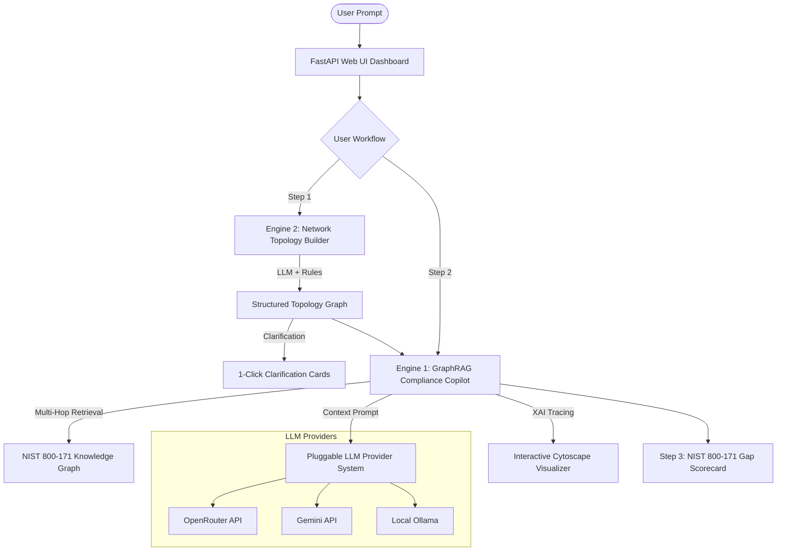

# GaRC (GraphRAG Automated Risk & Compliance)
> **OUPI Cyber Clinic Contest 2026 Entry** — *Category 2: AI-enabled cybersecurity solution for underserved communities*

GaRC is a guided Explainable AI (XAI) platform designed to make **NIST SP 800-171 Rev 3 compliance assessment** and **network topology modeling** accessible, automated, and explainable for small businesses, non-profits, and underserved organizations lacking dedicated SecOps staff.

---

## 🌟 Architecture & Core Engines



### 🗺️ Engine 2: Network Topology Builder
- **LLM-First Structured Extraction**: Parses messy, non-technical natural language descriptions into canonical network nodes (subnets, devices, storage, VPNs) and edge relationships with rule-based fallback.
- **Interactive Clarification Cards**: Automatically flags ambiguous security attributes (e.g. unconfirmed volume encryption or MFA) and prompts the user for 1-click confirmation.

### 💬 Engine 1: GraphRAG Compliance Copilot
- **"Guide, Don't Prescribe" Intuition Engine**: Acts as a CISO's intuition engine and auditor's assistant. Generates investigative flags (🔍), cloud scope alerts (☁️), and network segmentation risk warnings (⚠️) with actionable **Action for Assessor** prompts.
- **Multi-Hop Subgraph Retrieval & XAI Tracing**: Traverses the NIST SP 800-171 Knowledge Graph (`Query` $\to$ `Control` $\to$ `Objective` $\to$ `Active Topology Node`) and dynamically renders the exact reasoning path on an interactive Cytoscape canvas.

### 📊 Step 3: NIST SP 800-171 Gap Scorecard
- **Dynamic Readiness Scoring**: Computes your overall compliance readiness percentage based on active network topology attributes.

---

## ⚡ Easiest Way to Run (Python Only — Zero Node.js Required!)

GaRC includes a **built-in standalone Web UI** served directly by FastAPI. You do **NOT** need Node.js, npm, or Docker to run it!

### Step 1: Set Up Backend Environment & Dependencies
```powershell
cd backend

# Create & activate virtual environment (Windows PowerShell):
python -m venv venv
.\venv\Scripts\activate

# On Linux/macOS:
# source venv/bin/activate

# Install requirements:
pip install -r requirements.txt
```

### Step 2: Configure API Key (.env)
Copy `.env.example` to `.env`:
```powershell
cp .env.example .env
```
Open `.env` and add your **OpenRouter API Key** (or Gemini API Key):
```env
LLM_PROVIDER=openrouter
OPENROUTER_API_KEY=sk-or-v1-your-key-here
OPENROUTER_MODEL=google/gemini-2.0-flash-001
```

### Step 3: Run FastAPI App

**Ensure your terminal is inside the `backend` directory:**
```powershell
cd backend
.\venv\Scripts\activate
python -m uvicorn app.main:app --reload --port 8001
```

### Step 4: Open Browser
Open **[http://localhost:8001](http://localhost:8001)** in your web browser! 🎉

*(Note: If Docker / Neo4j is not running, GaRC automatically boots in **In-Memory Fallback Mode**, preloaded with the full official NIST SP 800-171 Rev 3 CPRT dataset, so everything works out of the box!)*

---

## 🛠️ Alternative Setup Options

### Option A: Advanced React + Vite Frontend (Requires Node.js)
If you prefer running the Vite React development server separately:

1. **Start Backend Server**:
   ```powershell
   cd backend
   .\venv\Scripts\activate
   python -m uvicorn app.main:app --reload --port 8001
   ```
2. **Start Frontend Dev Server**:
   ```powershell
   cd frontend
   npm install
   npm run dev
   ```
3. Open browser at **[http://localhost:3000](http://localhost:3000)**.

### Option B: Local Neo4j Container Stack (Docker)
If you want to run a live dedicated Neo4j instance instead of in-memory fallback:
```powershell
docker compose up -d
```

---

## 📄 License
[MIT License](LICENSE)