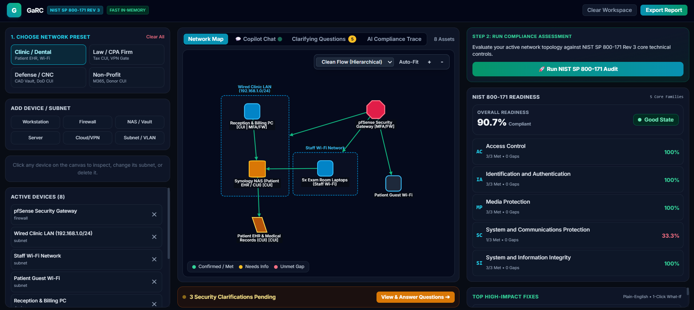
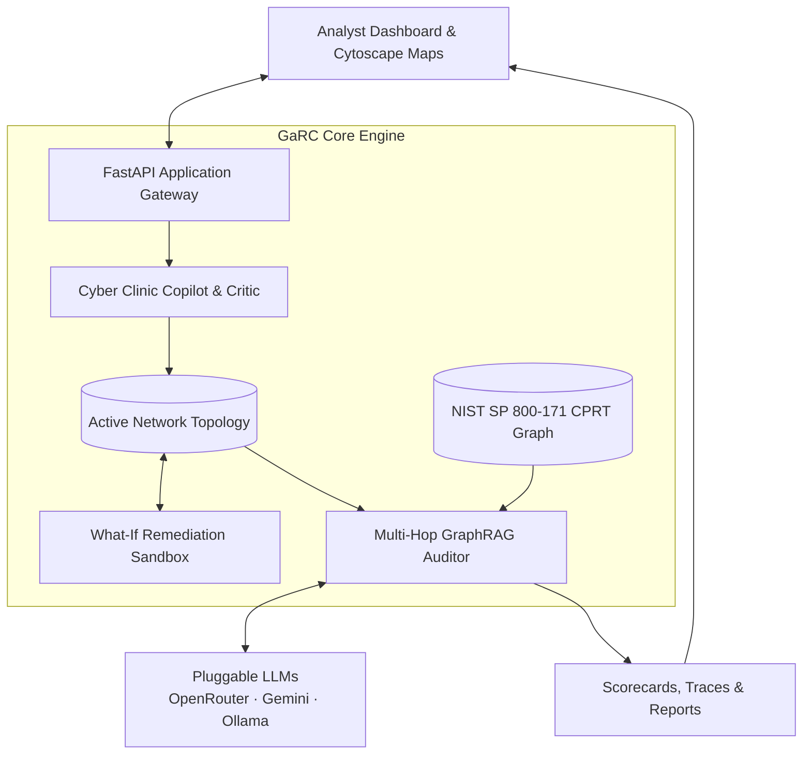

# GaRC: Graph-Augmented Risk and Compliance

[](https://www.python.org/)
[](https://fastapi.tiangolo.com/)
[](https://csrc.nist.gov/pubs/sp/800/171/r3/final)
[](https://neo4j.com/)
[](LICENSE)

**OUPI Cyber Clinic Contest 2026 Entry**  
*Category 2: AI-Enabled Cybersecurity Solution for Underserved Communities*

---

## 📸 Demo Preview



---

## 📑 Table of Contents

- [Overview](#overview)
- [System Architecture](#system-architecture)
- [Key Capabilities](#key-capabilities)
  - [1. Conversational Cyber Clinic Copilot](#1-conversational-cyber-clinic-copilot)
  - [2. Agentic Critic and Self-Repair Loop](#2-agentic-critic-and-self-repair-loop)
  - [3. Interactive "What-If" Remediation Sandbox](#3-interactive-what-if-remediation-sandbox)
  - [4. Dual-Mode Cytoscape Graph Visualization](#4-dual-mode-cytoscape-graph-visualization)
  - [5. Decoupled Baseline Knowledge Graph](#5-decoupled-baseline-knowledge-graph)
- [Technical Control Families Covered](#technical-control-families-covered)
- [Getting Started](#getting-started)
  - [Prerequisites](#prerequisites)
  - [Quick Start: Built-in Standalone UI (Recommended)](#quick-start-built-in-standalone-ui-recommended)
  - [Alternative Setup: Dedicated Neo4j Stack (Docker)](#alternative-setup-dedicated-neo4j-stack-docker)
  - [Alternative Setup: React + Vite Frontend](#alternative-setup-react--vite-frontend)
- [API Endpoints](#api-endpoints)
- [Automated Test Suite](#automated-test-suite)
- [Project Structure](#project-structure)
- [License](#license)

---

## Overview

GaRC (Graph-augmented Risk & Compliance) is an Explainable AI (XAI) cybersecurity decision-support platform engineered to make **NIST SP 800-171 Rev 3** compliance and network security posture assessment accessible, deterministic, and actionable for small organizations, community clinics, non-profits, and defense supply chain contractors lacking dedicated security personnel.

Unlike generic language models that hallucinate regulatory advice, GaRC pairs an LLM-driven **Conversational Cyber Clinic Copilot** with an immutable **NIST CPRT Knowledge Graph** (198 nodes, 197 relational edges). Every finding, risk score, and recommended remediation is deterministically mapped across family standards, individual controls, and formal assessment objectives.

---

## System Architecture



---

## Key Capabilities

### 1. Conversational Cyber Clinic Copilot
* **Plain-Language Advisory**: Explains core concepts (Controlled Unclassified Information, Multi-Factor Authentication, Network Segmentation) in clear, plain English tailored for non-technical administrators.
* **Natural Language Infrastructure Extraction**: Converts conversational infrastructure descriptions into canonical assets (subnets, firewalls, servers, storage volumes, cloud services, and client devices).
* **Direct CPRT Traceability**: Every control mentioned in the chat interface embeds interactive deep links that navigate and illuminate paths within the knowledge graph.

### 2. Agentic Critic and Self-Repair Loop
* **Orphan Healing**: Identifies floating workstations or appliances and reconnects them to appropriate local subnets based on operational context.
* **Dangling Edge Pruning**: Detects and purges invalid or broken connections.
* **CUI Storage Validation**: Inspects storage volumes containing Controlled Unclassified Information and generates targeted verification prompts if encryption attributes are unconfirmed.
* **Guest Wi-Fi Isolation**: Identifies bridging between guest networks and internal clinical or production databases, generating warning notices for remediation.

### 3. Interactive "What-If" Remediation Sandbox
* **One-Click Security Simulations**: Evaluates the compliance impact of proposed fixes before making physical infrastructure changes:
  * Encrypt CUI Storage Volumes (Addresses NIST 03.01.03, 03.08.01, 03.13.08)
  * Enforce Multi-Factor Authentication (Addresses NIST 03.05.03, 03.05.04)
  * Segment Guest Wi-Fi (Addresses NIST 03.13.01, 03.13.06)
  * Deploy Boundary Security Gateway / Firewall (Addresses NIST 03.13.01, 03.13.02)
* **Real-Time Score Delta**: Instantly recalculates readiness scores across the 5 technical control families and highlights projected percentage gains.
* **Instant Rollback**: Reverts simulated changes with a single click, returning the topology to its baseline state.

### 4. Dual-Mode Cytoscape Graph Visualization
* **Network Map (Hierarchical Clean Flow)**: Automatically structures network assets from perimeter firewalls down through subnets, application servers, storage volumes, and client endpoints without line crossing.
* **AI Compliance Trace (Calibrated Organic Constellation)**:
  * Centers on the 5-Family Technical Audit Root.
  * Disperses the 5 core families into dedicated radial lobes using force-directed physics with zero node collisions.
  * Represents ~140 determination objectives as clean orbital satellite nodes, eliminating text-box overlap.
  * Dynamic hover and click inspectors display formal requirement definitions, discussions, assessor actions, and evidence requirements.

### 5. Decoupled Baseline Knowledge Graph
* **Zero-Delay Exploration**: Loads all 198 CPRT nodes and edges on application start without requiring a prior topology audit.
* **Dynamic State Transition**: When an audit is triggered, node styles transition smoothly from pre-audit baseline states to verified statuses:
  * Confirmed / Met (Green)
  * Needs Information (Amber)
  * Unmet Gap (Red)

---

## Technical Control Families Covered

GaRC implements full objective-level assessment across the five core technical families of NIST SP 800-171 Rev 3:

| Family Code | Family Name | Scope | Controls | Objectives |
| :--- | :--- | :--- | :--- | :--- |
| **03.01** | Access Control (AC) | Account management, least privilege, remote access, wireless access | 16 | 42 |
| **03.05** | Identification & Authentication (IA) | Multi-factor authentication, authenticator management, replay resistance | 8 | 21 |
| **03.08** | Media Protection (MP) | CUI storage sanitization, media marking, media access control | 7 | 18 |
| **03.13** | System & Communications Protection (SC) | Boundary defense, VLAN segmentation, cryptographic protection in transit | 10 | 38 |
| **03.14** | System & Information Integrity (SI) | Malicious code protection, system monitoring, flaw remediation | 5 | 19 |
| **Total** | **5 Core Technical Domains** | **End-to-end technical controls** | **46** | **138** |

---

## Getting Started

### Prerequisites
* Python 3.10 or higher
* Modern web browser (Chrome, Edge, Firefox, or Safari)
* Optional: Docker (for dedicated Neo4j graph database instance)
* Optional: Node.js 18+ (only if running the standalone Vite development server)

---

### Quick Start: Built-in Standalone UI (Recommended)

GaRC includes a production-ready single-page application served directly by FastAPI. No Node.js or npm toolchain is required.

#### 1. Clone the Repository and Navigate to Backend
```bash
git clone https://github.com/24alexl/garc.git
cd garc/backend
```

#### 2. Create and Activate Virtual Environment

**Windows PowerShell:**
```powershell
python -m venv venv
.\venv\Scripts\activate
```

**Linux / macOS:**
```bash
python3 -m venv venv
source venv/bin/activate
```

#### 3. Install Dependencies
```bash
pip install -r requirements.txt
```

#### 4. Configure Environment Variables
Copy the example environment file:
```bash
cp .env.example .env
```

Edit `.env` to configure your preferred LLM provider. Example for OpenRouter:
```env
LLM_PROVIDER=openrouter
OPENROUTER_API_KEY=your-api-key-here
OPENROUTER_MODEL=google/gemini-2.0-flash-001
```

*(Note: If no API key is provided, GaRC operates using robust rule-based heuristic fallbacks and the pre-compiled CPRT dataset.)*

#### 5. Launch the Server
```bash
python -m uvicorn app.main:app --reload --port 8001
```

#### 6. Access the Application
Open your browser and navigate to:
```
http://localhost:8001/
```

*Note on Persistence: If Neo4j is not detected on port 7687, GaRC automatically starts in In-Memory Mock Graph mode, pre-populated with the complete NIST SP 800-171 Rev 3 dataset.*

---

### Alternative Setup: Dedicated Neo4j Stack (Docker)

To run GaRC with a dedicated Neo4j graph database:

```bash
docker compose up -d
```

Update `.env` in the `backend/` directory:
```env
NEO4J_URI=bolt://localhost:7687
NEO4J_USER=neo4j
NEO4J_PASSWORD=garcpassword
```

Seed the database with official NIST SP 800-171 Rev 3 controls:
```bash
cd backend
python -m app.db.seed_nist_800_171
```

---

### Alternative Setup: React + Vite Frontend

If you wish to modify or develop against the separate React source code:

```bash
# Terminal 1: Backend API
cd backend
.\venv\Scripts\activate
python -m uvicorn app.main:app --reload --port 8001

# Terminal 2: Frontend Dev Server
cd frontend
npm install
npm run dev
```

The frontend development server will run at `http://localhost:3000/`.

---

## API Endpoints

| Method | Endpoint | Description |
| :--- | :--- | :--- |
| `GET` | `/` | Serves the standalone GaRC visual dashboard |
| `GET` | `/api/templates` | Lists pre-configured network topology templates (Clinic, Legal, Defense, Non-Profit) |
| `POST` | `/api/templates/load/{id}` | Loads a specific network topology template into the active workspace |
| `POST` | `/api/topology/parse` | Natural language text-to-topology parser with critic self-repair loop |
| `POST` | `/api/chat/copilot` | Cyber Clinic Copilot conversational Q&A and infrastructure modification |
| `GET` | `/api/compliance/baseline-graph` | Fetches the complete 198-element NIST SP 800-171 Rev 3 baseline knowledge graph |
| `POST` | `/api/audit/evaluate-topology` | Executes multi-hop GraphRAG compliance audit across all 5 technical families |
| `POST` | `/api/audit/explain-control` | Generates deep XAI assessment finding and remediation instructions for a control |
| `POST` | `/api/sandbox/simulate-fix` | Simulates a one-click security remediation and calculates score deltas |
| `POST` | `/api/sandbox/revert-fix` | Reverts a simulated fix and restores the active network topology |
| `GET` | `/api/report/export` | Generates comprehensive compliance audit summary and assessor report |

---

## Automated Test Suite

GaRC includes automated unit and integration tests covering parser logic, critic repair loops, GraphRAG reasoning, What-If simulation, and API endpoints.

Execute the test suite from the `backend/` directory:

```bash
cd backend
.\venv\Scripts\python -m pytest tests -v
```

Expected output:
```
============================== 17 passed in ~12s ==============================
```

Test coverage includes:
* `test_critic_and_repair_loop_orphan_healing`: Verifies unattached assets are placed in suitable subnets.
* `test_critic_and_repair_loop_dangling_edge_pruning`: Verifies orphaned references are safely pruned.
* `test_critic_and_repair_loop_cui_clarification_generation`: Verifies automatic prompt generation for CUI assets.
* `test_conversational_copilot_educational_qa`: Verifies plain-language advisory capabilities.
* `test_conversational_copilot_topology_mutation`: Verifies natural language infrastructure graph updates.
* `test_what_if_simulation_and_revert`: Verifies remediation simulations and delta tracking.
* `test_api_endpoints_agent_loops_and_sandbox`: Validates HTTP API contract compliance.
* `test_graphrag_retriever` and `test_parallel_topology_audit`: Validates NIST CPRT graph traversals.

---

## Project Structure

```
garc/
├── backend/
│   ├── app/
│   │   ├── db/
│   │   │   ├── neo4j_client.py           # Neo4j graph driver with in-memory fallback
│   │   │   └── seed_nist_800_171.py      # CPRT knowledge graph seed data
│   │   ├── engine_graphrag/
│   │   │   ├── retriever.py              # Multi-hop CPRT subgraph extraction
│   │   │   └── xai_reasoner.py           # Parallel family auditor and baseline graph builder
│   │   ├── engine_topology/
│   │   │   ├── parser.py                 # Copilot chat, critic loop, and What-If sandbox
│   │   │   └── schema.py                 # Pydantic data schemas for assets and compliance
│   │   ├── llm/
│   │   │   ├── factory.py                # Pluggable LLM factory
│   │   │   ├── openrouter_provider.py    # OpenRouter API integration
│   │   │   ├── gemini_provider.py        # Google Gemini integration
│   │   │   └── ollama_provider.py        # Local Ollama integration
│   │   ├── static/
│   │   │   └── index.html                # Standalone dashboard (Cytoscape + React + Tailwind)
│   │   └── main.py                       # FastAPI application setup and routing
│   ├── tests/                            # Pytest test suite
│   ├── requirements.txt                  # Python dependencies
│   └── .env.example                      # Environment configuration template
├── frontend/                             # Optional React + Vite frontend source
├── docker-compose.yml                    # Local Neo4j container orchestration
├── LICENSE                               # Apache 2.0 License
└── README.md                             # Documentation
```

---

## License

This project is licensed under the Apache 2.0 License. See the [LICENSE](LICENSE) file for details.
